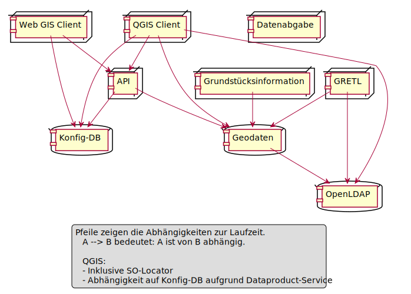
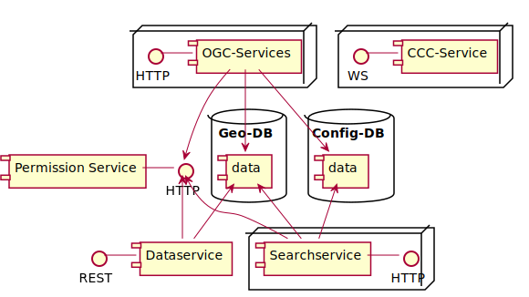
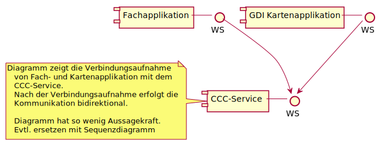
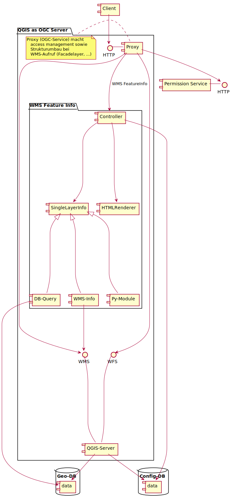
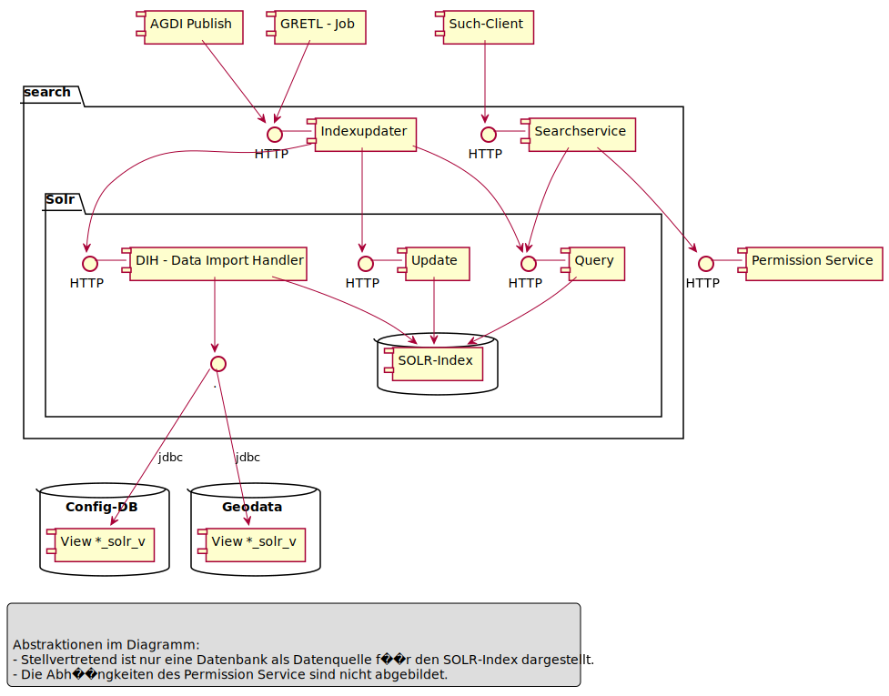

# Komponentendiagramme der GDI des Kantons Solothurn
## Erläuterung der Diagrammelemente

Der Client nutzt (ist Abhängig von):
* Das Subsystem "mapservice" via Interface WMS. 
* Die Komponente "worker" via Interface HTTP

In den Diagrammen steht das "Kastensymbol" für ein **abstrahiertes Subsystem**. Die Details des Subsystems werden dabei in einem folgenden separaten Detaildiagramm erläutert.

"FeatureInfo" ist ein Beispiel für ein **Package**. Mit einem Package werden Subsysteme innerhalb eines Diagrammes dargestellt.

SpatialQuery und Py-Module sind mittels **Vererbungspfeil** mit "FeatureInfo" verbunden. Damit wird ausgedrückt, dass "FeatureInfo" als "SpatialQuery" und als "Py-Module" umgesetzt ist.   

Die Diagramme werden mittels (https://plantuml.com/) erstellt.

## $td Zentrale Komponenten
* Geodatenbanken
* Config-DB
* Permission Service
* OpenLDAP-Verzeichnis
* AIO SES

## Uebersichtsdiagramm aller Subsysteme

Subsysteme (alphabetisch):
* **API:** Dienste, welche von mehreren Subsystemen und oder Applikationen genutzt werden.
* **Datenabgabe:** Bereitstellung der Raster- und Vektordaten für die Nutzung in Drittprogrammen (Ausserhalb der GDI).
* **Geodaten:** Zentrale Datenhaltung der Geodaten. Vektordaten in PostGIS. Raster / Lidar als Dateien mit Katalog. Vektordaten liegen in den Erfassungsumgebungen relational vor, in der Publikations-DB in der Form denormalisierter "flachgewalzter" Geo-Tabellen. 
* **Grundstücksinformation:** API's und Applikationen für die grundtückzentrische Nutzung der Geodaten.
  * Oereb-Kataster
  * Eigentümer-Abfrage
* **GRETL:** ETL-Werkzeug zwecks Publikation, Input und Output von Vektordaten (tabellarischen Daten). Mittels GRETL erfolgt die Publikation und Denormalisierung eines Datenstandes von einer Erfassungs-Umgebung auf die Publikations-DB.
* **Konfig-DB:** Metainformations-Datenbank, in welcher zu einem Datensatz dokumentiert ist
  * Zugriffsberechtigungen
  * Kontaktinformationen
  * Nutzung in welchen funktionalen Komponenten (Aenderungsmanagement)
  * ETL Verarbeitungsketten (Aenderungsmanagement)
  * Unter welcher Bezeichnung und mit welchen Darstellungen und Attributen der Datensatz publiziert ist.
* **OpenLDAP:** Verwaltung der Datenbankzugriffe für:
  * Das Editieren mittels QGIS-Client
  * Die Zugriffe der Dienste auf die Geodaten
* **QGIS Client:** Desktop-GIS Anwendung für die Datenpflege und die Datennutzung für erfahrene GIS-Nutzer
* **Web GIS Client:** Browser-Webapplikation für die einfache alltägliche Nutzung der Geodaten in Kartenform.

## API

Komponenten und Subsysteme:
* **CCC-Service:** Bilaterale Kommunikationsschnittstelle, mit welcher Fachapplikationen ohne GIS-Fähigkeiten die Karten- und Editierfunktionen der GDI nutzen können. Die Kommunikation erfolgt über Websocket.
* **Dataservice:** REST-Schnittstelle, über welche mittels GeoJson (Geo-)Daten mit oder ohne Geometrie gelesen und gechrieben werden können.
* **OGC-Services:** Stellt WMS und WFS für die Vektordatensätze der GDI bereit.
* $td WMTS
* **Searchservice:** Volltext-Suchservice für die Suche nach Kartenebenen und Orten. Bei der Suche nach Kartenebenen werden die Metadaten durchsucht; bei der Suche nach Orten die entsprechenden Geodatensätze.

### CCC-Service (API)

$td Erweitern mit Handshake-Sequenzdiagramm mit Web GIS Client

### OGC-Services (API)

Ist aufgebaut über die folgenden Komponenten (Top-Down):
* **Proxy (OGC-Service):** Dieser prüft für WMS und WFS die Zugriffsberechtigungen. Für WMS erledigt er zusätzlich:
  * Die Gruppierung von Kindebenen in Facadelayer.
  * Die Weiterleitung von FeatureInfo-Anfragen an das Featureinfo-Framework.
* **WMS Feature Info:** Sammelt pro betroffenem Datensatz die Informationen der Objekte unter dem Klickpunkt. Der Controller beauftragt konfigurationsabhängig die folgenden Komponenten für die Ermittlung von Geometrie und Attributen der Objekte:
  * DB-Query: Ermittlung mittels konfiguriertem SQL-Query auf die Publikations-DB.
  * WMS-Info: Ermittlung mittels WMS-GetFeatureInfo Aufruf an den QGIS-Server.
  * Py-Module: Ermittlung mittels Python-Modul. Die Python-Module teilen sich die immer gleiche Signatur ihrer Hauptmethode. Ein Python-Modul wird zum Beispiel als Adapter eingesetzt, wenn ein Dienst einer Drittapplikation in das Featureinfo eingebunden werden soll.
  * (SingleLayerInfo): Die obgenannten drei Module implementieren die jeweils gleiche Methode. Dies entspricht konzeptionell der Vererbung von SingleLayerInfo.
* **QGIS-Server:** Arbeitet die WMS- und WFS-Anfragen ab. 

### Searchservice (API)

Im Suchservice sind zwei "Familien" von Komponenten im Einsatz:
* Komponenten für die Aktualisierung des Solr-Index.
* Komponenten für die Verarbeitung von Suchanfragen.

Komponenten für die Aktualisierung des Suchindex:
* **AGDI Publish** und **GRETL-Job** beauftragen den Indexupdater
* Der **Indexupdater**
  * Entfernt mittels **Update** den zu aktualisierenden Teil des Index.
  * Lädt den Teil mittels **DIH** von den Quellen neu in den Index.
  * Frägt während dem neu Laden mittels **Query** den Fortschritt ab. 

Der **Searchservice** nimmt die Anfragen von Clients entgegen. Der Searchservice enthält:
* Das Einschränken der Suche auf nur Kartenebenen oder nur Adressen, Grundstücke, ...
* Die Prüfung der Berechtigung (für Ortssuchen).

