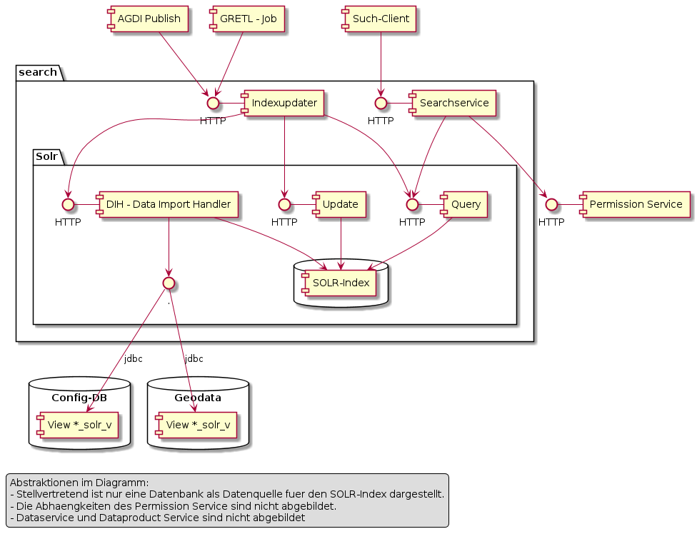

# Subsystem "Suche"

## Überblick

Volltext-Suchservice für die Suche nach Kartenebenen und Orten. 

Die folgenden Objekttypen können mittels Suchservice gesucht werden:
* Karten(ebenen) sprich DataProducts. Beispiel: Layergruppe "Amtliche Vermessung". Folgend als **Metasuche** bezeichnet.
* Features. Also die Objekte einer Kartenebene wie Beispielsweise eine Adresse. Folgend als **Featuresuche** bezeichnet.

### Im Suchservice umgesetzte konzeptionelle Ziele

* **Treffend und umfassend:** Treffend ist als "bestmögliche" Resultat-Sortierung umgesetzt. 
Umfassend betrifft insbesondere die Metasuche. Umgesetzt mittels Indexierung von Synonymen, Stichworten und Beschreibung.  
* **Schlank und schnell:** Grundsätzlich werden lediglich Informationen in den Index aufgenommen, welche für das
Anzeigen der Resultatliste und den Aufruf von Folgefunktionen erforderlich sind. Ausnahme: Extent bei Featuresuchen.
* **Ein Index für Geo- und Metasuche:** Um auch bei gemeinsamem Suchfeld für Geo- und Metasuche sehr schnelle
Antwortzeiten zu erreichen, kommt ein einziger generischer Suchindex über die Metasuche und alle Featuresuchen zur Anwendung.
* **Delegation an Sub-Services:** Für das Anzeigen eines Geoobjektes wird anschliessend der DataService verwendet,
für das Ermitteln weitergehender Informationen zu einem Layer der Dataproduct-Service. 

## Komponenten



### Packages (Gruppierungen im Diagramm)

#### Solr

Apache Solr  mit den Standardkomponenten Data Import Handler (DIH), Query und Update. 

Komponenten und deren Verwendung für die Suche:
* **Query:** HTTP-Interface, mit welchem die Suchanfragen an Solr gesendet werden. 
Verwendet wird das HTTP-GET basierte Query interface.
* **Update, DIH (und Query):** Werden orchestriert vom Indexupdater verwendet, um den betroffenen Teil des Index 
via Update-HTTP-Interface zu löschen und anschliessend via DIH neu aus der Quelle zu laden.

Siehe dazu die offizielle Solr-Dokumentation zu [Query](https://lucene.apache.org/solr/guide/7_7/requesthandlers-and-searchcomponents-in-solrconfig.html#searchhandlers), 
[Update](https://lucene.apache.org/solr/guide/7_7/requesthandlers-and-searchcomponents-in-solrconfig.html#updaterequesthandlers) und
[Data Import Handler](https://lucene.apache.org/solr/guide/7_7/uploading-structured-data-store-data-with-the-data-import-handler.html). 

####  Search

Umfasst die für das AGI entwickelten Komponenten der Suche:

Im Suchservice sind zwei "Familien" von Komponenten im Einsatz:
* **Searchservice:** Komponente für die Verarbeitung von Suchanfragen. Erledigt das Access-Management für Featuresuchen 
und wandelt eingegebene Schlüsselwörter in die entsprechende "Where Clause" für "Query" um. Von sourcepole entwickelt. 
$td Link auf das Repository, sobald public. 
* **Indexupdater:** Bietet den Clients (AGDI, GRETL) ein HTTP-Interface zur Beauftragung von Index-Aktualisierungen
und arbeitet diese in einer Queue mittels der Solr-Komponenten "Update", "DIH" und "Query" ab. AGI-Eigenentwicklung 
[Link auf Repo](https://github.com/sogis/indexupdater).

## Benutzerdokumentation (AGI)

* $td Wie das Ganze im AGDI Konfiguriert wird... --> Referenz auf das entsprechende Kapitel im AGDI Benutzerhandbuch

## Betrieb
* Welche Openshift-Projekte...
* Via's (GDI-Gateway, SES, ...)
* Solr-Cloud

$td Todo:
* "Zusammenstöpseln" für den Solr Dataimporthandler
* Manuell Indexslice neu laden
* Manuell den ganzen Index mittels Admin-Interface neu laden

Die Solr-Konfiguration wird im git repo [sogis/solr](https://github.com/sogis/solr) verwaltet.

### Problemanalyse mittels Shell-Skript

Für die Problemanalyse eignen sich CURL basierte Shellskripte, mit welchen unter Umgehung der Searchservice-Komponente
direkt ermittelt werden kann, welche Antwort die aktive Solr-Konfiguration auf eine bestimmte Anfrage gibt.

Die Shellskripte bilden die im "Searchservice" enthaltene Query ab.
* Für Suchbegriff mit einem Teil [one.sh](search_res/one.sh)
* Für Suchbegriff mit drei Teilen "solo röti 4" [three_query.sh](search_res/three_query.sh)

## Modelldokumentation des Solr-Index

Es wurde ein generalisierter Solr-Index für die Feature- und Metasuche aufgebaut, welcher die im einleitenden Kapitel
beschriebenen konzeptionellen Ziele erfüllt.

Jede Suchanfrage löst in Solr eine Wortstammsuche und eine Buchstabengruppen-Suche aus. Die Buchstabengruppen-Suche 
ermöglicht das hochperformante Finden von Suchbegriffen mit führender Wildcard. Fachbezeichnung des genutzten Algorithmus
in englisch: Ngram.

### Beschreibung der Attribute im Solr-Index

**Attribute für Identifizierung und Anzeige**

|Name|Muss?|Beschreibung|
|---|---|---|
|id|Ja|Enthält die indexweit eindeutige ID eines Solr-Dokumentes.|
|display|Ja|Enthält den String, welcher 1:1 als Text bei den Suchresultaten angezeigt wird.|
|facet|Ja|Umfasst die grobe Typisierung der Objekte gemäss ihren «Ursprungsklassen» (Kartenebene, Adresse, …). Auf diese wird das Faceting angewendet, um die Treffer nach Kategorie zu unterscheiden und nur Treffer der entsprechenden Hauptkategorie anzeigen zu können. Bei Lokalisierungsobjekten entspricht diese der subclass ("ch.so. ..."). Bei allen dataproducts lautet der Wert "dataproduct".|
|sort|Nein|Enthält einen String, um innerhalb von Treffern gleicher Relevanz eine Detailsortierung vorzunehmen (Beispielsweise bei Adressen).|

**Bemerkungen zum Aufbau des id-Feldes**

Die ID ist ein JSON-Array of Strings mit zwei Zellen:
* Auf [0] der Name der Subklasse des Objektes.
* Auf [1] der Wert der stabilen ID des Objektes. Immer als String codiert.

Beispiele für «adresse» und «flurnamen»:

|Json-Array Zelle [0]|Json-Array Zelle [1]|
|---|---|
|«ch.so.agi.av.gebaeudeadressen.gebaeudeeingaenge»|«13275442»|
|«ch.so.agi.av.gebaeudeadressen.benannte_gebiete»|«35fd7e9f-22b3-4d54-9f4c-4655d6d21273»|

Beispiele für die Metasuche:

|Json-Array Zelle [0]|Json-Array Zelle [1]|
|---|---|
|«datasetview»|«ch.so.afu.altlasten»|
|«layergroup»|«ch.so.avt.oev»|
|«facadelayer»|«ch.so.arp.richtplan»|

UUID’s werden hex codiert ohne geschweifte Klammern - «35fd7e9f-22b3-4d54-9f4c-4655d6d21273»

**Attribute für die Wortstammsuche**

|Name|Muss?|Beschreibung|
|---|---|---|
|search_1_stem|Ja|Umfasst die treffendsten Informationen zu einem Objekt. Als Wörter indexiert.|
|search_2_stem|Nein|Umfasst den Inhalt von search_1_stem sowie die zweittreffendsten Informationen zu einem Objekt. Als Wörter indexiert.|
|search_3_stem|Nein|Umfasst den Inhalt von search_2 sowie die dritttreffendsten Informationen zu einem Objekt. Auf dieses Feld wird jeweils die Filterquery-Abfrage mit leading und trailing wildcard abgesetzt. Als Wörter indexiert.

**Attribute für die Buchstabengruppen-Suche**

|Name|Muss?|Beschreibung|
|---|---|---|
|search_1_ngram|Ja|Inhalt siehe Feld search_1_stem. Als Buchstabengruppen indexiert.|
|search_2_ngram|Nein|Inhalt siehe Feld search_2_stem. Als Buchstabengruppen indexiert.|
|search_2_ngram|Nein|Inhalt siehe Feld search_2_stem. Als Buchstabengruppen indexiert.|

**Attribute ausschliesslich für die Metasuche**

|Name|Muss?|Beschreibung|
|---|---|---|
|dset_info|(Ja)|Boolean-Feld, welches für Kartenebenen angibt, ob eine Beschreibung verfügbar ist oder nicht.
|dset_children|Nein|Enthält bei Gruppenebenen ein JSON-Array (als String) der anzuzeigenden Kinder (Json-Objekte).|

Muss = (Ja) bedeutet, dass die Angabe für alle Objekte der Metasuche (=Layer) zwingend ist.

Die Json-Objekte im Feld dset_children haben die folgenden Attribute:
* subclass: Typ der Subklasse (facadelayer, …)
* ident: Identifier des Dataproduct’s (ch.so. …)
* display: Sprechender «Titel» der Ebene
* dset_info: Gibt an, ob eine Ebenebeschreibung vorhanden ist.

Beispiel Json:

```json
[{
    "subclass": "datasetview",
    "ident": "ch.so.arp.naturschutzobjekte.amphibienstandorte",
    "display": "Amphibienstandorte",
    "dset_info": true
},
{
    "subclass": "datasetview",
    "ident": "ch.so.arp.naturschutzobjekte.amphibien_karch_objekte",
    "display": "KARCH-Objekte Amphibien",
    "dset_info":false
}]
```

Im Array sind die Kindebenen einer Gruppe wie im AGDI konfiguriert sortiert. So sollen sie in der
Resultatliste auch dargestellt werden.

**Attribute ausschliesslich für die Featuresuche**

|Name|Muss?|Beschreibung|
|---|---|---|
|bbox|(Ja)|bbox des Feature gemäss Geojson-Spezifikation. Bei Punktobjekten können daraus einfach die Koordinaten abgeleitet werden.|
|idfield_meta|(Ja)|Json-Array, welches bei Lokalisierungsobjekten Name und Feldtyp des ID-Feldes enthält.|

Muss = (Ja) bedeutet, dass die Angabe für alle Objekte der Featuresuche zwingend ist.

Das Feld idfield_meta ist als Json-Array aufgebaut. In der ersten Zelle ist der Feldname enthalten, in der
zweiten Zelle der Feldtyp (String ja/nein).

Mögliche Werte für Feldtyp:
* «str:y» Feld ist von Typ String
* «str:n» Feld ist nicht von Typ String

Beispiel: ```["t_id","str:n"]```

